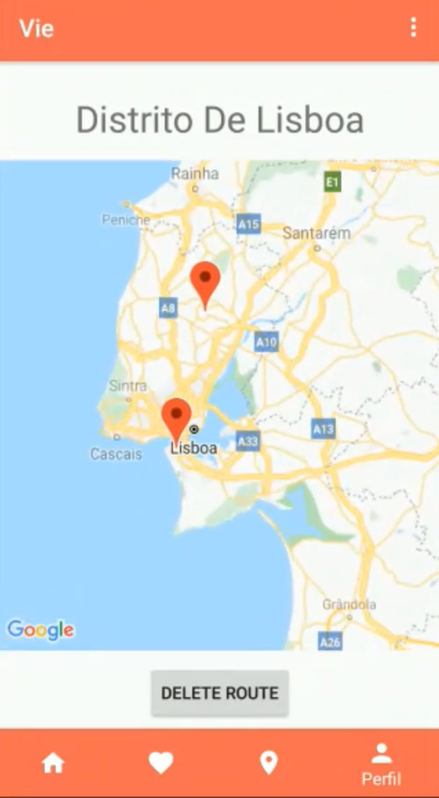
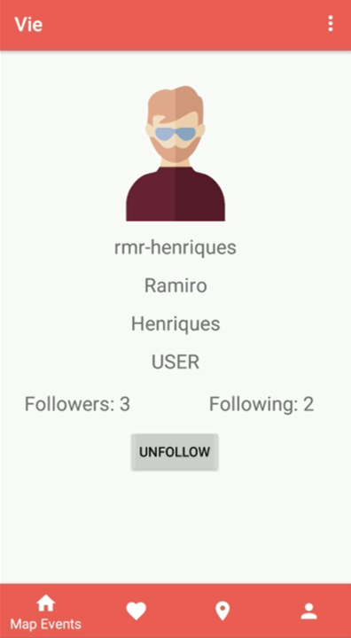

# Abris

# A Ambição

## Vie

Vie é uma aplicação Web e Android. Vie traduz-se para tanto para caminho como para vida em Francês, um duplo significado apropriado para o conceito do nosso produto, através de caminhos mudamos vidas. Na nossa aplicação poderás aceder a percursos solidários e criar os teus próprios percursos. Também podes usar a aplicação para conhecer outras pessoas tal como tu interessadas em voluntariado.

# A Equipa

### A Equipa Abris é constituída por 5 elementos

## António Santos, nº 51879

  **Gosta de:** Tiro com Arco

  **Não gosta de:** Pimentos

## Inês Rocha, nº 53206

  **Gosta de:** Anime

  **Não gosta de:** Acordar Cedo

## Pedro Bailão, nº 53675

  **Gosta de:** The Legend Of Zelda

  **Não gosta de:** Sonic

## Ramiro Henriques, nº 52535

  **Gosta de:** Futebol

  **Não gosta de:** Adeptos de Futebol

## Salvador Silva, nº 54597

  **Gosta de:** Sporting

  **Não gosta de:** Dentista

